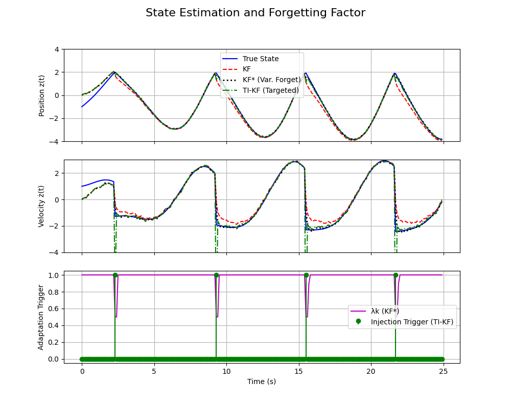

# Adaptive Kalman Filtering with RLS-Inspired and Physics-Informed Methods

This repository contains the Python implementation for the replication and extension of the paper *"Adaptive Kalman Filtering Developed from Recursive Least Squares Forgetting Algorithms" by B. Lai and D. S. Bernstein (2024)*.

## Abstract

The standard Kalman Filter (KF), while optimal for linear systems with Gaussian noise, performs poorly when faced with unmodeled events. This project first replicates the work of Lai & Bernstein, which proposes an Adaptive Kalman Filter (KF\*) that leverages a variable forgetting factor from the Recursive Least Squares (RLS) domain to dynamically adjust its process noise covariance. We validate their findings on a mass-spring-damper system subject to unmodeled collisions, showing the KF\*'s superior performance over the standard KF. Building upon this, we introduce a novel, physics-informed improvement called the **Targeted Injection Kalman Filter (TI-KF)**. This method selectively injects uncertainty only into the states directly affected by the physical disturbance (velocity), rather than applying a general correction. Comparative analysis demonstrates that this targeted approach yields a significant improvement in estimation accuracy, resulting in a near-perfect state track that outperforms both the standard and the paper's adaptive filter.

## Background and Motivation

The core challenge addressed by this work is the fragility of the Kalman Filter to model mismatch. When a real-world system deviates from its mathematical model, for instance due to an impulsive force, a standard KF can become overconfident in its erroneous state estimate and fail to recover quickly.

The paper by Lai and Bernstein (2024) presents an elegant solution by establishing a formal connection between two cornerstone algorithms:

> Extensions to Recursive Least Squares (RLS), particularly those using forgetting factors to track time-varying parameters, can be mathematically translated into special cases of the Kalman Filter with a specific, adaptive process noise covariance ($Q_k$).

This project explores this concept by implementing their proposed adaptive filter (KF\*) and then develops a more physically intuitive extension.

## The Simulation Scenario

To test the filters, we use the numerical example from the paper: a mass-spring-damper system.

- **System:** A linear mass-spring-damper model whose position and velocity are to be estimated.
- **The Unmodeled Event:** A rigid wall is placed at position $z=2$. When the mass collides with the wall, its velocity instantaneously reverses. **Crucially, the filters' internal models do not know this wall exists.** This collision serves as a recurring, unmodeled impulsive disturbance.

## Methodology

Three distinct filters are implemented and compared in this simulation:

1.  **Standard Kalman Filter (KF):** The baseline filter using a fixed process noise covariance $Q_k$. It is expected to perform poorly after each collision.

2.  **Adaptive Kalman Filter (KF\*):** The filter proposed in the paper. It uses a statistically-derived variable forgetting factor, $\lambda_k$, to automatically increase the process noise when a large prediction error is detected. This makes the filter temporarily less confident and more responsive to new measurements.

3.  **Targeted Injection Kalman Filter (TI-KF) - Our Extension:**
    This novel method is built upon a simple physical intuition: a collision instantaneously shocks the **velocity** state but leaves the **position** state unchanged (at the wall). The KF\*'s approach of increasing uncertainty across *all* states is therefore a "sledgehammer" that discards good position information.

    The TI-KF uses a "scalpel" approach:
    - It uses a chi-squared innovation test to detect the collision event.
    - When triggered, it injects uncertainty **only** into the variance of the velocity estimate by adding a predefined injection matrix, $Q_{\text{inject}}$, to the covariance matrix $P_k$:
    
      ```
      P_k  <--  P_k + Q_inject
      
      where Q_inject = [[0.0, 0.0],
                        [0.0, uncertainty_value]]
      ```
    This selectively targets the source of the model mismatch without corrupting the otherwise accurate position estimate.

## Results and Analysis

The superior performance of the proposed TI-KF is best illustrated by comparing estimated states for all three filters.

<p align="center">
  
</p>

From the results in above figure, we can draw the following conclusions:

- **Standard KF (Red)** as expected, the  performs poorly. After each collision, its deviates from the true state and then corrects very slowly, indicating poor tracking performance for a significant duration.
- **Adaptive KF (black)** exhibits a noticeable lag and overshoot after collision, but still does a good job at tracking the true state.
- **Targeted Injection KF (green)** corrects almost instantaneously without any overshoot, being faster than the Adaptive KF.
- The Adaption Trigger subplot exhibits this instantaneous correction of TI-KF as compared to a slower correction for the Adaptive KF method.

## Repository Structure

This project is organized in a modular structure for clarity and extensibility.

-   `main.py`: The main script. It orchestrates the simulation, runs all three filters, and passes the results to the plotting script.
-   `config.py`: Contains all system parameters, simulation settings, and filter configurations.
-   `simulation.py`: Implements the ground truth physics engine for the mass-spring-damper system, including the unmodeled wall collision logic.
-   `filters.py`: Contains the object-oriented implementations of the `StandardKF`, `AdaptiveKF`, and our `TargetedInjectionKF`.
-   `plot.py`: Contains functions to generate all the figures for analysis.
-   `Images/`: Directory containing all generated plots and diagrams.

## How to Run the Simulation

1.  **Clone the repository:**
    ```bash
    git clone https://github.com/Charukhesh/AdaptiveKF_RLS.git
    cd AdaptiveKF_RLS
    ```
2.  **Install dependencies:**
    Ensure you have Python 3 installed. The only required packages are NumPy and Matplotlib.
    ```bash
    pip install numpy matplotlib
    ```
3.  **Run the main script:**
    Execute `main.py` from the root directory of the project.
    ```bash
    python main.py
    ```
    The script will run the simulation and display the comparison plots.

## References

[1] B. Lai and D. S. Bernstein, "Adaptive Kalman Filtering Developed from Recursive Least Squares Forgetting Algorithms," *arXiv preprint arXiv:2404.10914*, 2024.

[2] R. E. Kalman, "A New Approach to Linear Filtering and Prediction Problems," *Transactions of the ASME–Journal of Basic Engineering*, vol. 82, no. Series D, pp. 35-45, 1960.

[3] C. Paleologu, J. Benesty, and S. Ciochina, "A Robust Variable Forgetting Factor Recursive Least-Squares Algorithm for System Identification," *IEEE Signal Processing Letters*, vol. 15, pp. 597-600, 2008.
